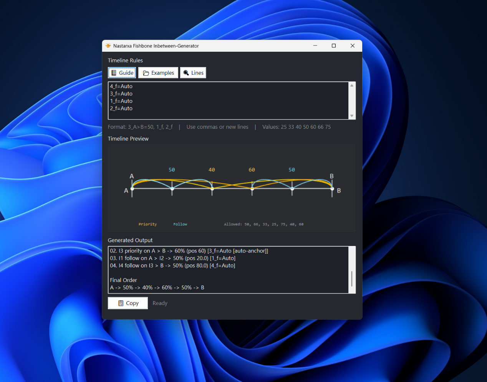
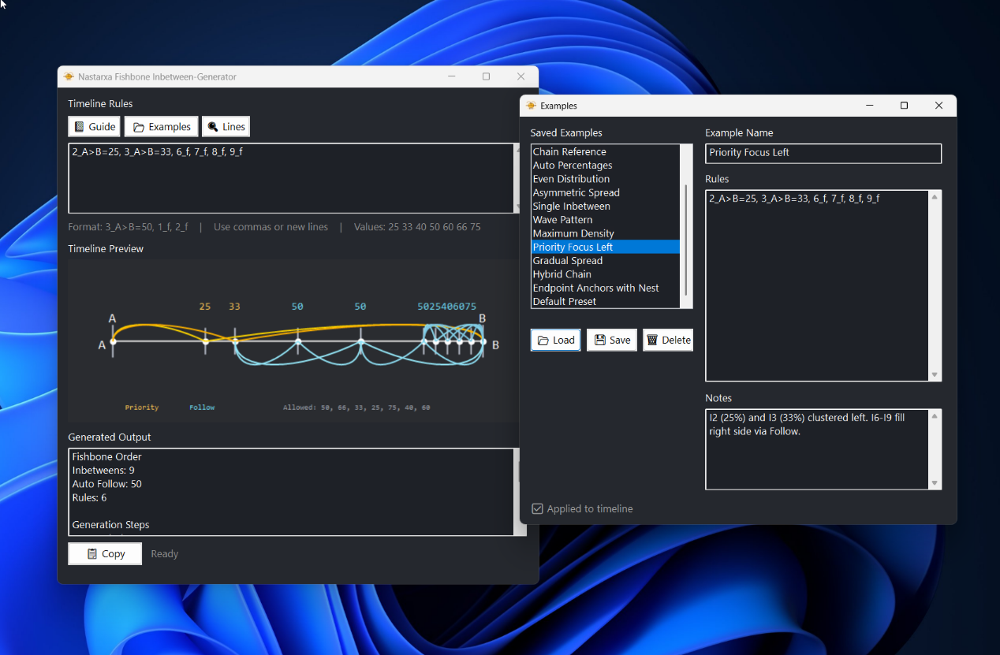
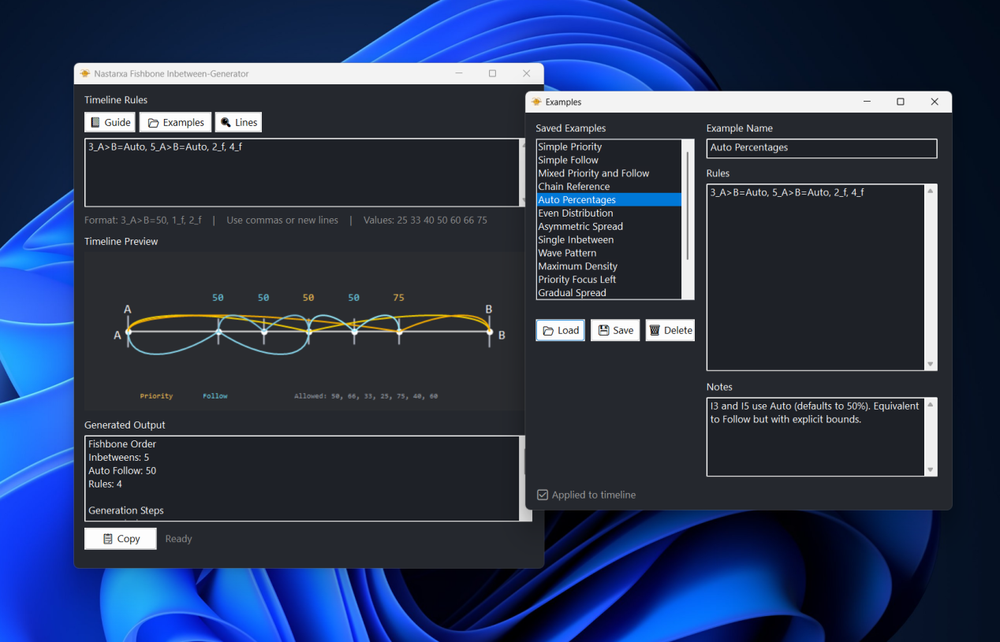
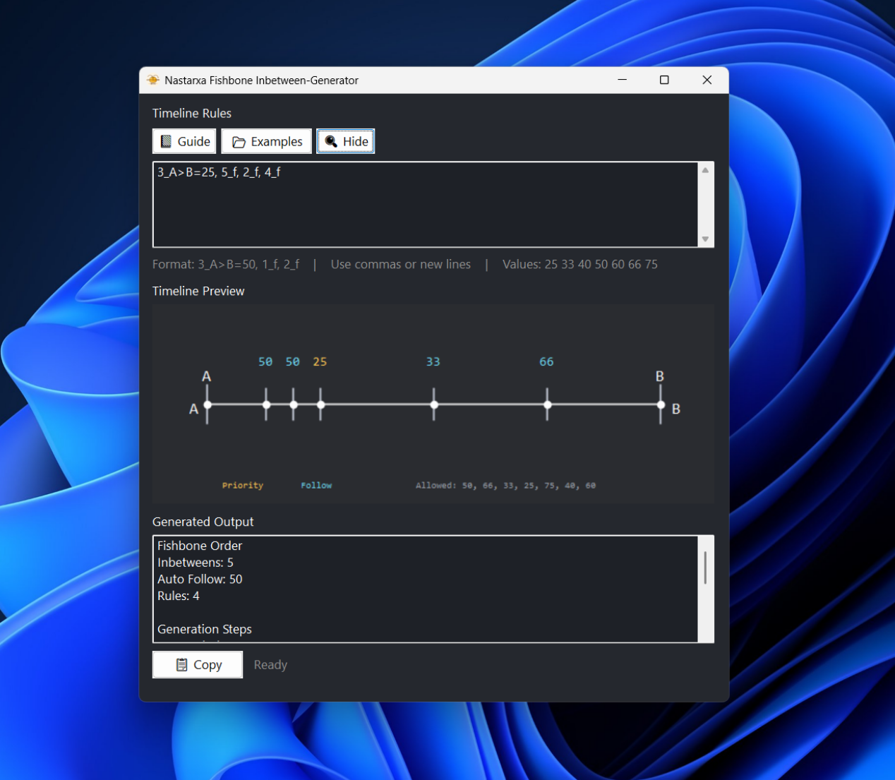
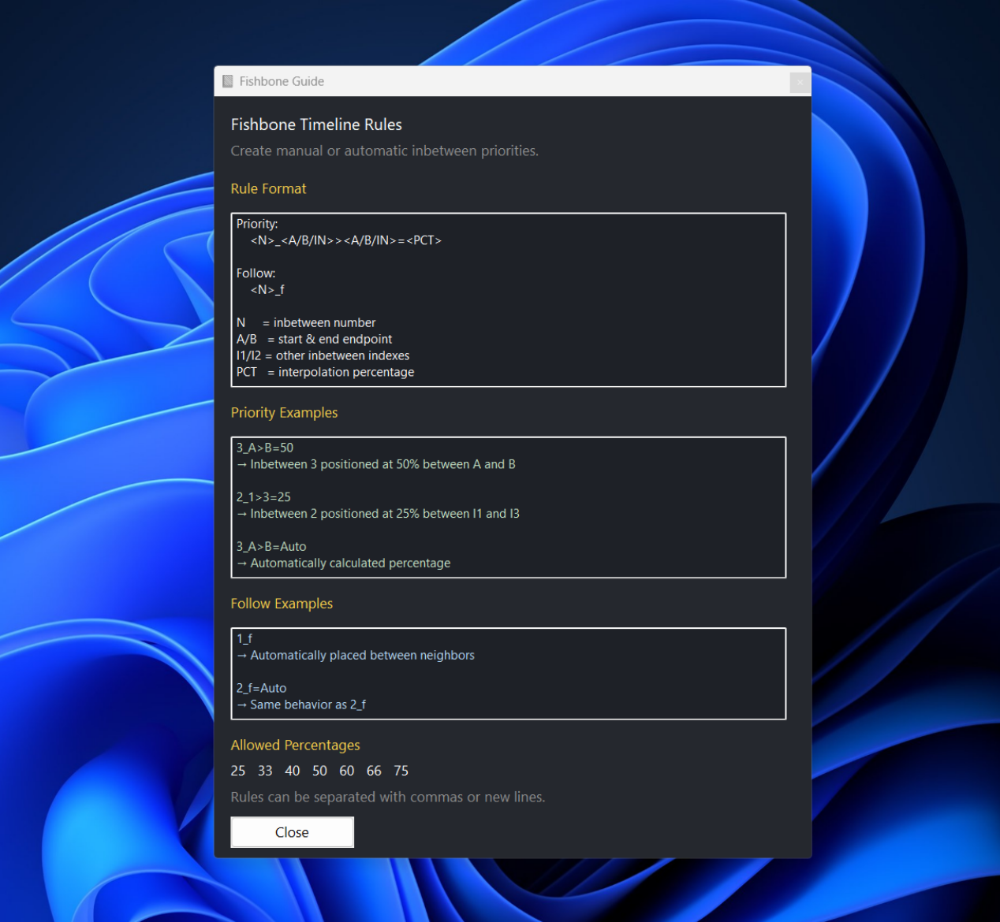

# 🐟 Nastarxa Fishbone Inbetween Generator

An AutoHotkey v2 tool for planning and visualizing animation inbetween timing using an interactive fishbone timeline preview.

Designed for animators who want a fast and visual way to experiment with spacing, timing, and inbetween placement.

---

# 🎯 Purpose

This tool is designed to make animation spacing:
- easier to read
- faster to iterate
- visually understandable
- more experimental and expressive

Useful for:
- sprite animation
- pixel art animation
- keyframe timing
- spacing experiments
- hand-drawn workflows

---

# ✨ Features

- **🎞 Visual Timeline Preview**  
  GDI+-rendered fishbone diagram showing inbetween placements along a timeline axis.

- **🧠 Priority Rules**  
  Manually position specific inbetweens at exact percentages between endpoints or other inbetweens.

- **🌊 Follow Rules**  
  Automatically place inbetweens between neighboring timing points.

- **🎨 Color-Coded Branches**  
  Priority branches use gold while follow branches use cyan for quick readability.

- **📝 Live Rule Editor**  
  Edit rules directly and see the timeline update instantly.

- **📂 Examples Manager**  
  Save, load, and delete reusable rule configurations with notes.

- **📘 Built-in Guide**  
  Includes rule syntax reference and usage examples.

- **🪟 Resizable Interface**  
  Window and canvas automatically adapt to different sizes.

---

# ⌨ Hotkey

| Key | Action |
|---|---|
| `Ctrl + F1` | Open the Fishbone Timeline window |

---

# 🖼 Image Preview







---

# 🧩 Rule Format

## Priority Rules

Position a specific inbetween at a fixed percentage.

### Format

```txt
<N>_<A/B/IN>><A/B/IN>=<PCT>
```

| Part | Description |
|---|---|
| `N` | Inbetween number |
| `A/B` | Endpoint A or B |
| `I1/I2` | Other inbetween indexes |
| `PCT` | Percentage (`25`, `33`, `40`, `50`, `60`, `66`, `75`) or `Auto` |

### Examples

```txt
3_A>B=50
2_1>3=25
3_A>B=Auto
```

```txt
3_A>B=50
→ Inbetween 3 positioned at 50% between A and B

2_1>3=25
→ Inbetween 2 positioned at 25% between I1 and I3

3_A>B=Auto
→ Automatically calculated spacing
```

---

## Follow Rules

Automatically place an inbetween between its neighbors.

### Format

```txt
<N>_f
```

### Example

```txt
3_f
```

```txt
3_f
→ Inbetween 3 automatically follows neighboring spacing
```

---

# 📊 Allowed Percentages

```txt
25   33   40   50   60   66   75
```

Rules may be separated using:
- commas
- new lines

---

# 🚀 Usage

1. Press `Ctrl + F1` to open the Fishbone Timeline window
2. Enter priority and follow rules in the editor
3. The fishbone preview updates live
4. Copy generated output or save rules as examples

---

# 🛠 Requirements

- AutoHotkey v2.0+
- Windows
- GDI+ support

---

# 📁 File Structure

| File | Description |
|---|---|
| `Nastarxa Fishbone Inbetween Generator.ahk` | Main script |
| `Fishbone Examples.ini` | Saved examples and notes |
| `Fishbone.ico` | Tray icon |

---

# 📜 License

MIT License
See [LICENSE](/LICENSE).

---

## ⚠️ Disclaimer

This project was developed with the assistance of AI tools.
AI was used to support code writing, refactoring, and documentation, while the design direction, features, and final implementation were guided and reviewed by the author.
