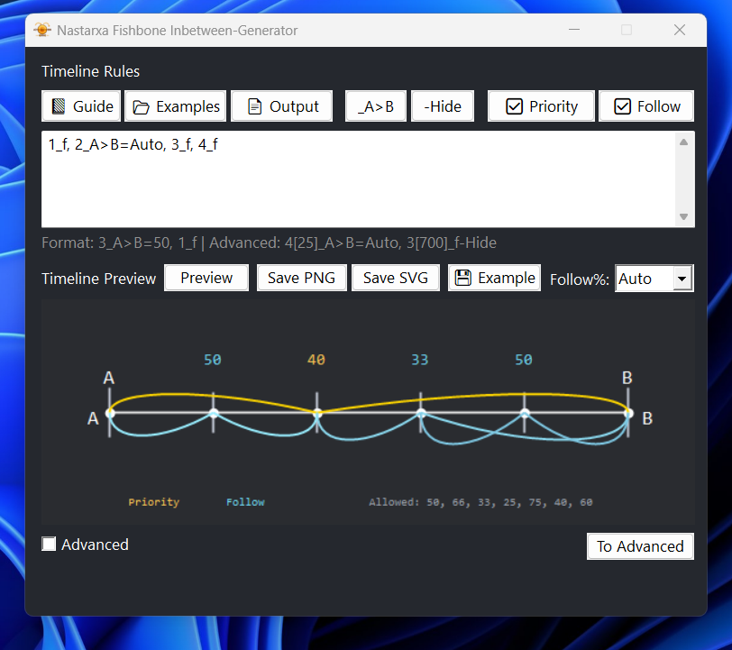
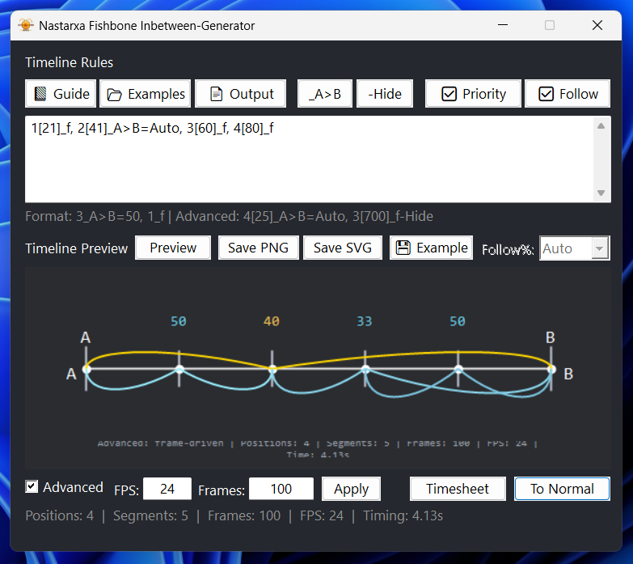
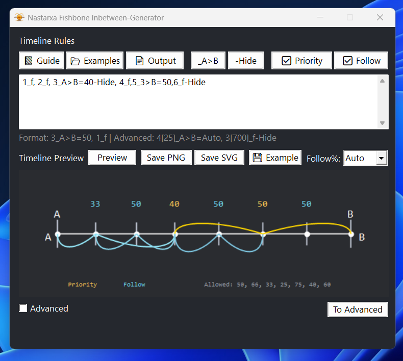
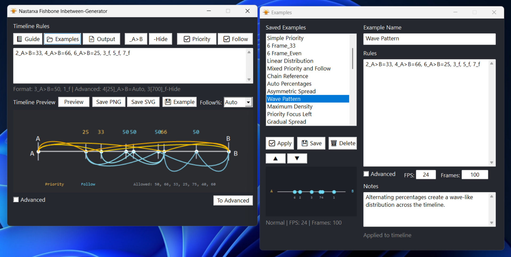
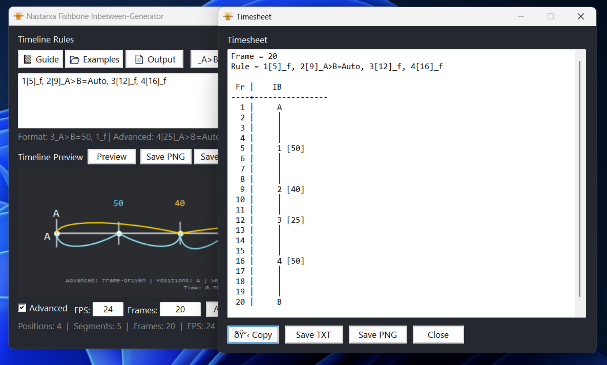
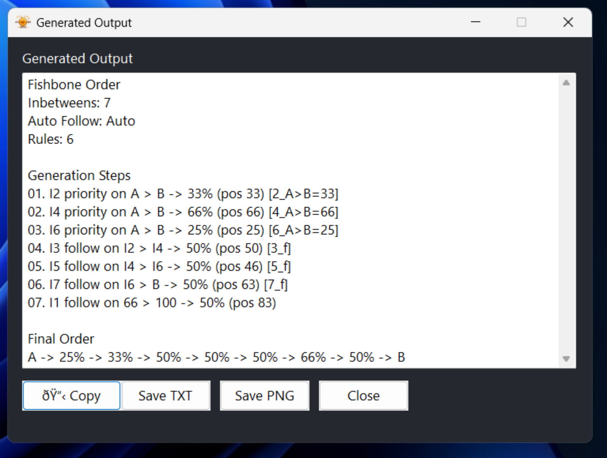

# 🐟 Nastarxa Fishbone Inbetween Generator

> 🎬 Visual animation spacing planner for AutoHotkey v2.

Design, preview, and export animation inbetween spacing using a fishbone-style timeline.


---

## 🖼 Image Preview









---

## ✨ Features

### 🦴 Fishbone Timeline Preview

Visualize spacing between two key poses.

```text
A |--|---|----|--|> B
```

### 🎯 Priority-Based Placement

Place an inbetween at an exact percentage.

```text
1_A>B=50
2_A>B=33
3_A>B=75
```

Supported values:

```text
25, 33, 40, 50, 60, 66, 75, Auto
```

### 🔄 Follow-Based Placement

Automatically distribute inbetweens between existing anchors.

```text
1_f
2_f
3_f
```

Hide a guide line:

```text
3_f-Hide
```

### 📅 Advanced Frame Mode

Place inbetweens directly on timeline frames.

```text
1[20]_f
2[50]_A>B=75
3[80]_f
```

### ▶️ Playback Preview

* Adjustable FPS
* Adjustable Frame Count
* Real-time playback

### 📤 Export

Export generated timing as:

* PNG
* SVG
* TXT

Timesheets can also be exported as:

* TXT
* PNG

### 📚 Example Library

Store and reuse animation timing presets.

Included examples:

* 🐢 Slow In
* 🏃 Slow Out
* ⚖️ Ease In-Out
* 🏹 Anticipation
* 💥 Impact
* 🌊 Floating Motion
* ⚓ Heavy Object
* 🪶 Light Object
* ⚙️ Mechanical Motion
* 🎭 Cartoon Extreme

---

## ⚙️ Requirements

* Windows
* AutoHotkey v2
* GDI+

---

## 🚀 Quick Start

1. Run:

```text
Nastarxa Fishbone Inbetween-Generator.ahk
```

2. Enter timing rules.
3. Click **Preview**.
4. Adjust spacing until it feels right.
5. Export to PNG, SVG, or TXT.

---

## 📐 Rule Syntax

### 🔄 Follow Rules

Automatically distribute spacing.

```text
<N>_f
```

Examples:

```text
1_f
2_f
3_f
3_f-Hide
```

### 🎯 Priority Rules

Place an inbetween at a specific percentage.

```text
<N>_<LEFT>><RIGHT>=<PERCENT>
```

Examples:

```text
1_A>B=50
2_A>B=33
3_A>B=75
4_A>I2=66
```

### 🏷️ References

| Reference     | Meaning             |
| ------------- | ------------------- |
| A             | First Key Pose      |
| B             | Second Key Pose     |
| 1, 2, 3...    | Inbetween           |
| I1, I2, I3... | Inbetween Reference |

---

## 📊 Follow Percentage

The Follow dropdown controls how follow inbetweens are distributed.

Supported values:

```text
Auto
25
33
40
50
60
66
75
```

**Auto** distributes spacing evenly inside the available gap.

---

## 📅 Advanced Mode

Advanced Mode is frame-driven.

Instead of:

```text
1_A>B=50
```

You can specify:

```text
1[24]_f
```

Meaning:

> Place Inbetween 1 at Frame 24.

Supported bracket styles:

```text
1[24]_f
1(24)_f
1{24}_f
```

Examples:

```text
1[10]_f
4[25]_A>B=Auto
2[50]_A>B=40
3[700]_f-Hide
```

### ⚡ How It Works

* Bracket values represent timeline frames.
* `[25]` places an inbetween on frame 25.
* `_f` creates a follow-style inbetween driven by frame position.
* `_A>B=Auto` calculates the nearest useful percentage from the frame position.
* Numeric priority values force the inbetween value while the frame remains the placement source.
* If a frame exceeds the current preview length, the timeline automatically expands.

---

## 📝 Example Timesheet Output

```text
Frame = 100

Rule =
1[20]_f
2[50]_A>B=75

  Fr |    IB
----+----------------
   1 | A
  20 | 1 [40]
  50 | 2 [75]
 100 | B
```

---

## 🎞️ Example Timing Presets

| Preset               | Motion Style              |
| -------------------- | ------------------------- |
| 🐢 Slow In           | Accelerating Motion       |
| 🏃 Slow Out          | Decelerating Motion       |
| ⚖️ Ease In-Out       | Natural Motion            |
| 🏹 Anticipation      | Preparation Before Action |
| 💥 Impact            | Sudden Stop               |
| 🌊 Floating Motion   | Light Drifting Motion     |
| ⚓ Heavy Object       | Weighty Motion            |
| 🪶 Light Object      | Fast Responsive Motion    |
| ⚙️ Mechanical Motion | Even Timing               |
| 🎭 Cartoon Extreme   | Exaggerated Timing        |

---

## 🗂️ Project Structure

| File                                        | Purpose              |
| ------------------------------------------- | -------------------- |
| `Nastarxa Fishbone Inbetween-Generator.ahk` | Main application     |
| `Fishbone Examples.ini`                     | Saved examples       |
| `Fishbone.ico`                              | Application icon     |
| `docs/`                                     | Documentation assets |

---

## 📜 License

MIT License

See [`LICENSE`](./LICENSE).

---

## ⚠️ Disclaimer

This project was developed with the assistance of AI tools.
AI was used to support code writing, refactoring, and documentation, while the design direction, features, and final implementation were guided and reviewed by the author.
